# Multiplayer Tic-Tac-Toe on Nakama

Production-ready multiplayer Tic-Tac-Toe with a server-authoritative Nakama backend and an Expo/React Native mobile client. The project fulfills the Lila Games assessment requirements, including secure move validation, automated matchmaking, leaderboard tracking, timed game mode, deployment readiness, and multiplayer testing guidance.

## Published demo & hosted backend


- Mobile app published on Expo: https://expo.dev — the app can be opened in the Expo Go app by scanning the QR code (shown above) or by visiting the project's Expo URL. Replace the placeholder Expo URL with your actual published project link if needed.
- Nakama runtime backend deployed on AWS EC2. To point the mobile client to this hosted backend:

  - Update `mobile/services/nakamaClient.ts` with your EC2 public DNS or IP and the correct port (typically 7350 for the Nakama HTTP/WS API). Example:

```ts
const useSSL = false; // set to true if you configure TLS (WSS)
const host = "ec2-xx-xx-xx-xx.compute-1.amazonaws.com"; // replace with your EC2 public DNS or IP
const port = "7350";
const serverKey = "defaultkey";
```

  - Ensure your EC2 security group allows inbound traffic on the Nakama ports you use (7350 for API/WS, 7351 for Console) and any TLS/HTTP ports if you reverse-proxy.

  - If you expose Nakama over TLS (recommended for production), use a reverse proxy (nginx / ALB) or configure TLS on the instance and set `useSSL = true` in the client.


## Screenshots

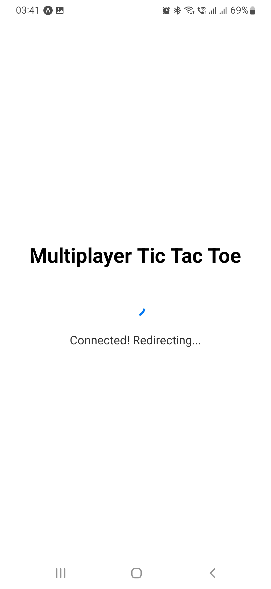

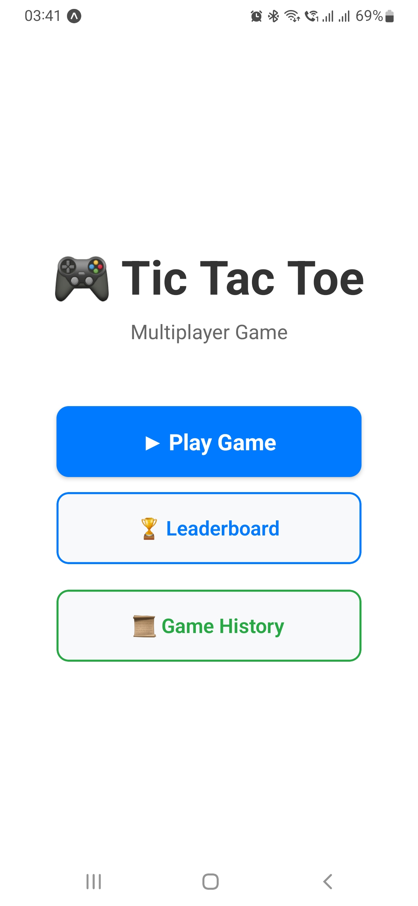

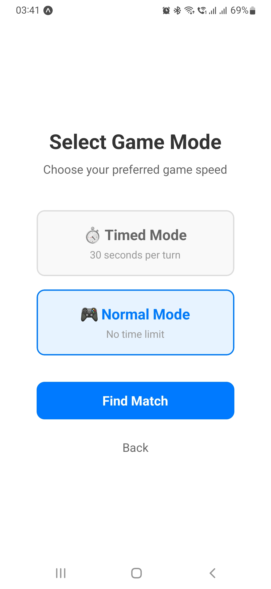

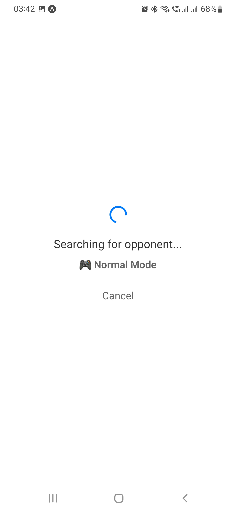

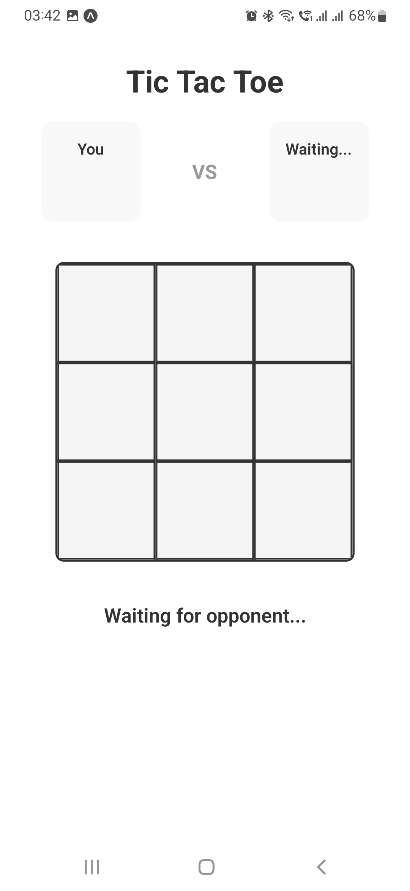

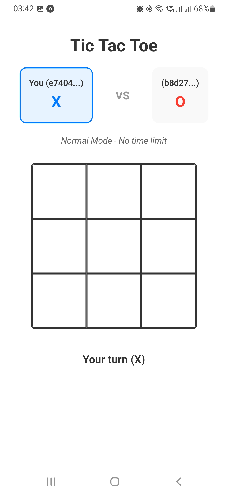

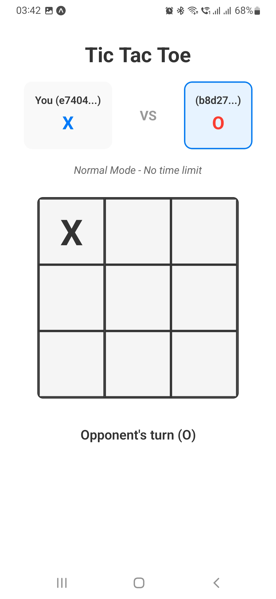

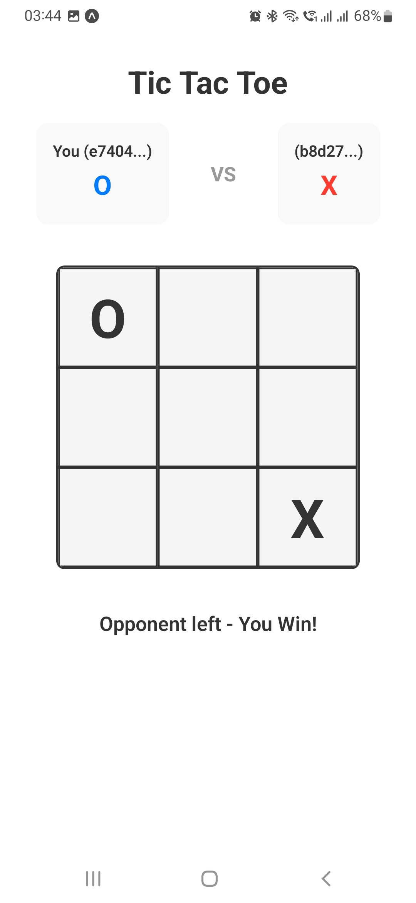

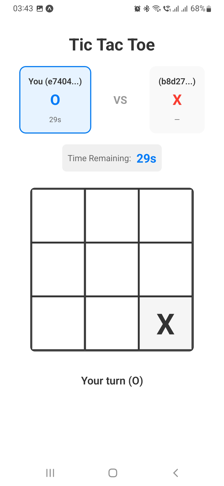

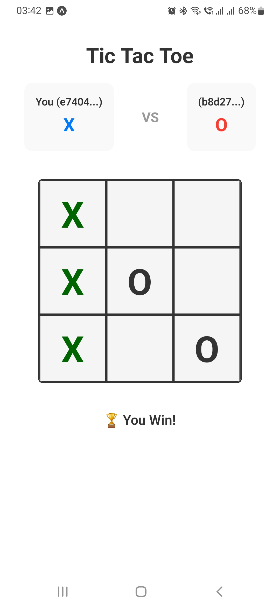

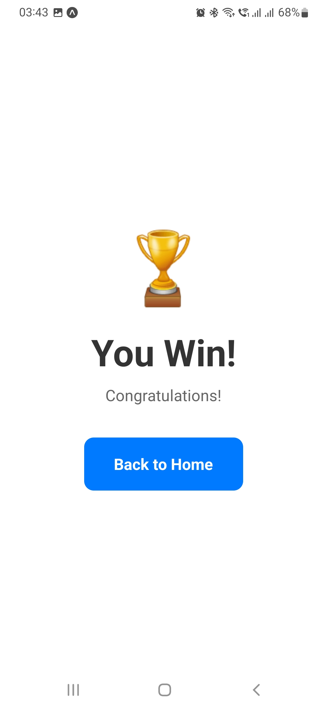

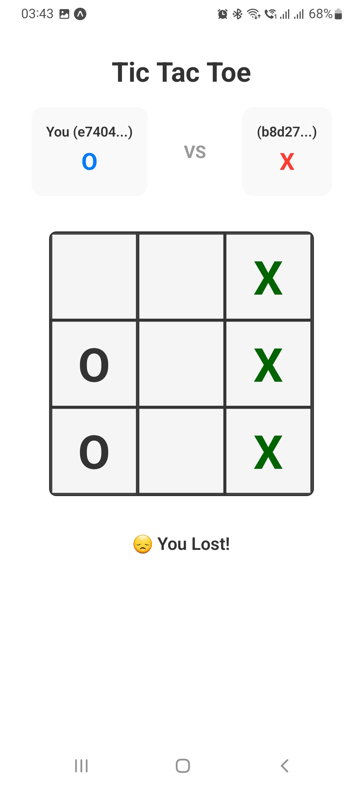

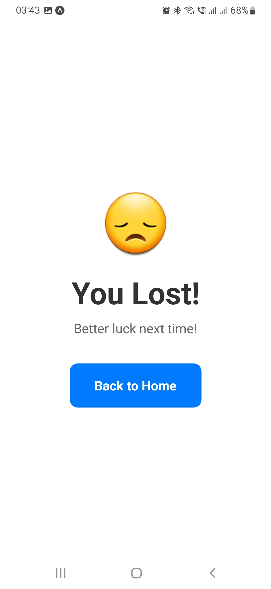

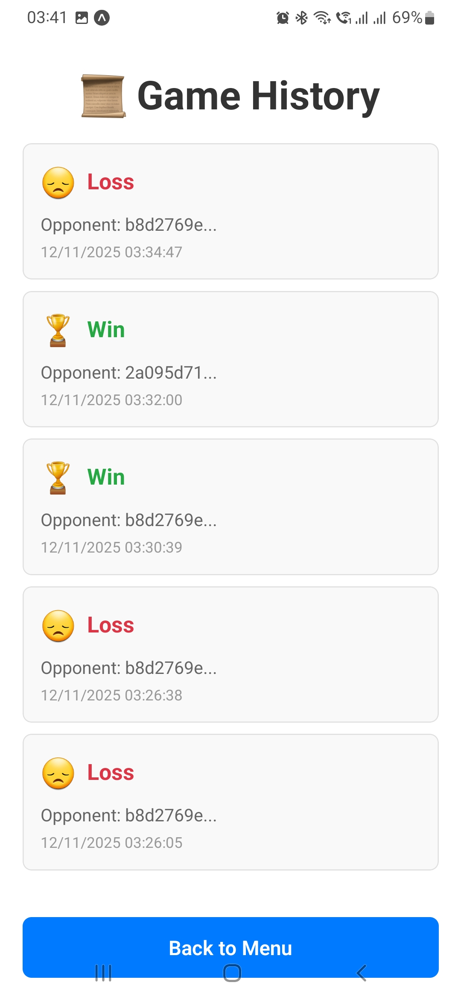

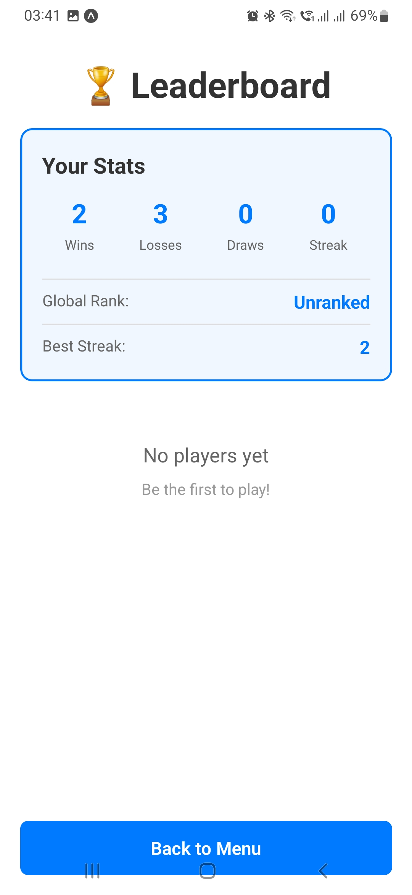

## Table of Contents
- [Architecture](#architecture)
- [Key Features by Requirement](#key-features-by-requirement)
- [Local Environment Setup](#local-environment-setup)
- [Configuration](#configuration)
- [Deployment Guide](#deployment-guide)
- [API & Message Contract](#api--message-contract)
- [Data & Persistence](#data--persistence)
- [How to Test Multiplayer](#how-to-test-multiplayer)
- [Operational Notes](#operational-notes)
- [Known Gaps & Next Steps](#known-gaps--next-steps)

## Architecture
- **Frontend:** Expo Router (React Native) application located in `mobile/`. Uses `@heroiclabs/nakama-js` for realtime WebSocket play, zustand for lightweight state, and AsyncStorage for session persistence.
- **Backend:** Nakama custom runtime module in `backend/` written in TypeScript and compiled to JavaScript. Core module entrypoint `build/index.js` is loaded via `local.yml`.
- **Infrastructure:** Dockerized Nakama + Postgres stack. A multi-stage Dockerfile compiles TypeScript before layering onto `heroiclabs/nakama:3.32.1`. `docker-compose.yml` orchestrates Postgres, migrations, and the Nakama process.
- **Data Flow:**
  1. Client authenticates via Nakama custom ID (persisted refresh token in AsyncStorage).
  2. `find_match_js` RPC lists/creates matches via structured labels (timed vs normal).
  3. Authoritative match handler (`match_handler.ts`) drives the game loop, validates moves, applies timers, and broadcasts START/UPDATE/DONE messages.
  4. Result pipeline (`recordGameResult`) persists stats, history, and leaderboard entries in Postgres through Nakama storage.
  5. Mobile client renders updates, timers, and transitions users to results, leaderboard, and history views.

```
Client (Expo RN) ──RPC/WS──> Nakama Runtime (TypeScript) ──SQL──> Postgres
   │                             │                                │
   └── React UI, timers         └── Match labels, RPCs,          └── Player stats,
       Async Storage                 authoritative logic              leaderboard, history
```

## Key Features by Requirement
- **Server-authoritative logic:** All boards, turn order, and timers live in the match state. `matchLoop` rejects invalid moves and enforces a 30s timeout only in timed mode (normal mode uses a one-hour grace window).
- **Matchmaking:** `rpcFindMatch` queries matches with label filters (+label.open/+label.timed) or creates a new authoritative match. Join attempts are guarded to avoid double connections and ensure rejoin safety.
- **Real-time updates:** Server emits opcode-driven START/UPDATE/DONE/REJECTED/OPPONENT_LEFT messages. Client normalizes them into UI state with consistent player mapping.
- **Disconnection handling:** Presence slots are reserved; rejoining players receive full board state. If the opponent leaves mid-match, the remaining player wins and receives both DONE and OPPONENT_LEFT events.
- **Concurrent sessions:** Labelled matches allow multiple concurrent sessions; match state is isolated per matchId and cleaned up after idle periods.
- **Leaderboard & player stats:** `recordGameResult` stores wins/losses/draws, streaks, and timestamps under `player_stats` and writes to `global_leaderboard`. `rpcLeaderboard` and `rpcGetStats` serve data to the mobile app.
- **Timer-based mode:** Mode selection on the client toggles `label.timed`. Timed matches enforce 30s per move; expiring turns simply switch to the opponent (no forfeits) to keep games flowing.
- **Daily rewards & notifications:** `rpcReward` grants 500 coins once per day and demonstrates wallet + notification usage. Session start/end hooks persist `last_online` and guarantee single-device sessions.

## Local Environment Setup

### Prerequisites
- Docker Desktop (or Docker Engine) with Compose plugin
- Node.js 18+ and npm
- Expo CLI (`npm install -g expo-cli`) or use `npx expo`
- A device/emulator on the same network as the Nakama server when running outside localhost

### Backend (Nakama)
```bash
cd backend
npm install          # installs TypeScript + Nakama runtime typings
npx tsc              # optional: compiles TS to build/index.js (Docker build runs this too)

```
Backends expose:
- gRPC/WS API: `http://localhost:7350`
- Console UI: `http://localhost:7351`

Logs stream in the compose terminal. To rebuild after code changes run `docker compose up --build` again.

### Mobile App (Expo)
```bash
cd mobile
npm install
npx expo start
```
- Press `a` to launch Android emulator, `i` for iOS simulator, or use Expo Go on device.
- Ensure the device can reach the Nakama host/port configured in `services/nakamaClient.ts`.

### Linking Client to Backend
Update the host in `mobile/services/nakamaClient.ts`:
```ts
const useSSL = false;          // set true when serving over HTTPS/WSS
const host = "127.0.0.1"; // replace with your backend hostname or IP
const port = "7350";
const serverKey = "defaultkey";
```
- When running on device, use your machine’s LAN IP.
- For production behind TLS, set `useSSL = true`, expose 443, and configure Nakama accordingly.

## Configuration
- `backend/local.yml` configures runtime entrypoint (`build/index.js`), log level, session expiry (2h), and socket limits.
- Database credentials default to Postgres user/password `postgres/localdb` (see `docker-compose.yml`). Update before production.
- Client profile data (username/avatar) lives in AsyncStorage; authentication uses `authenticateCustom(username, create=true)`.
- Timed vs normal mode is encoded in match labels (`timed:1` vs `timed:0`) and surfaced in matchmaking queries.

## Deployment Guide
1. **Backend container image**
   ```bash
   cd backend
   docker build -t your-registry/tictactoe-nakama:latest .
   docker push your-registry/tictactoe-nakama:latest
   ```
   Run container with Postgres connection string supplied via env var or config file. Sample command:
   ```bash
   docker run -d --name nakama \
     -p 7350:7350 -p 7351:7351 -p 7349:7349 \
     -e NAKAMA_DATABASE_ADDRESS="postgres://user:pass@db:5432/nakama?sslmode=disable" \
     -v $(pwd)/local.yml:/nakama/data/local.yml \
     your-registry/tictactoe-nakama:latest
   ```
2. **Database** – provision managed Postgres (AWS RDS, GCP Cloud SQL, etc.) or host it alongside Nakama. Run Nakama migrations (`nakama migrate up`).
3. **Frontend build** – for Expo:
   ```bash
   cd mobile
   expo build:android  # or eas build --platform android
   expo build:ios
   ```
   Configure `services/nakamaClient.ts` with the public Nakama URL. Distribute .apk/.aab/.ipa or host a web build via `expo export`.
4. **Networking** – open ports 7350/7351 (or reverse-proxy to 80/443). Use HTTPS/WSS in production. Consider placing Nakama behind a load balancer with sticky sessions if scaling horizontally.
5. **Observability** – route logs to a centralized sink (CloudWatch, GCP Logging). Enable Nakama metrics if needed.

## API & Message Contract
- **RPC Endpoints**
  - `find_match_js(payload: { timed: boolean }) -> { matchIds: string[] }`
  - `leaderboard_js(payload: "") -> { leaderboard: LeaderboardEntry[] }`
  - `get_stats_js(payload: "") -> PlayerStats`
  - `rewards_js(payload: null) -> { coinsReceived: number }`
  - `game_history_js(payload: "") -> { history: GameHistoryEntry[] }`
- **Match OpCodes**
  - `1 START` – initial board, mark assignments, deadline timestamp
  - `2 UPDATE` – board delta + next player turn + new deadline
  - `3 DONE` – terminal state, winner mark, winning positions
  - `4 MOVE` – client request `{ position: number }`
  - `5 REJECTED` – invalid move feedback
  - `6 OPPONENT_LEFT` – opponent disconnected/forfeited
- **Storage Collections**
  - `player_stats` – wins, losses, draws, streaks, total games, last played
  - `game_history` – last 100 matches per user with opponent IDs
  - `reward` – daily reward claim timestamps
  - `user_last_online` – session end timestamps
- **Leaderboard ID:** `global_leaderboard` (`score = wins - losses`).

## Data & Persistence
- **Match State** keeps board, presences, deadline ticks, and results until termination. Idle matches self-terminate after `maxEmptySec` (30s) with no players.
- **Stats** update atomically with versioned storage writes to avoid clobbering concurrent updates.
- **History** retains rolling window (100 entries) per user for the history screen.
- **Wallet & Rewards** use Nakama wallet APIs to add coins and send persistent notifications.

## How to Test Multiplayer
1. Start backend via `docker compose up`.
2. Launch Expo twice (two simulators or one simulator + one physical device). Ensure both clients point to the backend host.
3. From client A, press `Play Game`, choose mode, wait on “Searching for opponent…”. Do the same on client B.
4. Verify matchmaking transitions both clients to `/game`, marks are assigned X/O, and turns alternate.
5. Test invalid moves (tap out of turn) to see “Move rejected” toast.
6. Let timer expire in timed mode to confirm turn auto-switches without forfeit.
7. Close one client mid-game; the other should see “Opponent left” then auto-win.
8. After match, open `Leaderboard` and `Game History` screens to confirm stats updated.

## Operational Notes
- **Hot reload backend:** Re-run `npx tsc` then restart Nakama container since runtime watches compiled JS only.
- **Session enforcement:** `eventSessionStart` disconnects duplicate logins and notifies users on new device activity.
- **Scaling:** Use Nakama’s match label filters and/or matchmaker to shard by region or mode. Adjust `tickRate` and timers in `match_handler.ts` for different pacing.
- **Security:** Use HTTPS/WSS, rotate server keys, and replace `defaultkey` in production. Configure proper CORS and firewall rules.

## Known Gaps & Next Steps
- Automated CI builds/tests are not wired up; add workflows for TypeScript linting, Expo EAS builds, and container pushes.
- `nakamaClient.ts` currently defaults to a LAN IP; consider reading host/SSL flags from `.env` and injecting via Expo config.
- No automated unit/integration tests yet; seed with Jest tests for client services and harness-based match simulations for backend logic.
- Daily reward UI is not surfaced in the app; add a claim button and wallet visualization if required for product goals.
   - Check leaderboard updates

